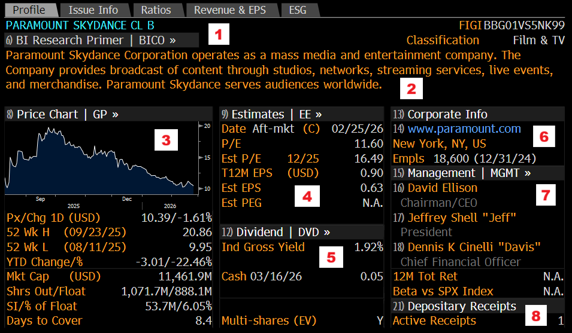

# DES - Security Description

`DES` is the main Bloomberg security description page. It consolidates key information about a security into a single starting screen.

## Use `DES` For

- Confirming you have the right security
- Reviewing the company profile and classification
- Checking key price, valuation, and dividend context
- Finding basic corporate and management information

## Toolbar Options

- Input field: Input the name of the security you want to examine (e.g. AAPL US Equity, PSKY US Equity, SGE LN Equity)
- Report: For equities, you also have the option to generate a report, which will create a PDF of the information available on the Security Description page.

## Profile

The Profile section gives a general overview of the security and the company behind it.

### 1. Name and Classification

The top section of `DES` contains the security name, FIGI (Financial Instrument Global Identifier), and BICS classification.

### 2. Extended Description

This longer description, often sourced from Hoover's Inc., gives additional background on the company.

### 3. Price Information

This section summarizes trading and market context for the security.

- `Px/Chg 1D`: The last traded price and one-day gain or loss.
- `52 Wk H/L`: The 52-week high and low, plus the dates on which they occurred.
- `YTD Change/%`: The year-to-date price change in dollars and percentage terms.
- `Mkt Cap`: The company's market capitalization.
- `Shrs Out/Float`: Shares outstanding and shares available in the public float.
- `SI/% of Float`: Shares sold short and short interest as a percentage of float.
- `Days to Cover`: The estimated number of trading days needed to cover all short positions based on average volume.

### 4. Estimates

This section contains analyst estimate data tied to the company.

- `Date`: The expected earnings-call date. `(C)` means confirmed, while `(E)` means estimated.
- `P/E`: The current price-to-earnings ratio.
- `Est P/E`: The estimated P/E ratio for the period shown.
- `T12M EPS`: Trailing-12-month earnings per share.
- `Est EPS`: Estimated earnings per share.
- `Est PEG`: Estimated price-to-growth ratio.
- `EU SSR Liquid`: Indicates whether the security is classified as a liquid share under the EU Short Selling Regulation.

### 5. Dividends

If the security pays a dividend, Bloomberg will surface the recent dividend profile here.

- `Ind Gross Yield`: Gross dividend yield based on the latest dividend and current price.
- `5Y Net Growth`: Five-year dividend growth.
- `Cash`: The most recent dividend payment date and cash amount.

### 6. Corporate Info

This area lists the company's website, location, and employee count.

### 7. Management

This area lists key leadership such as the CEO and CFO.

### 8. Depository Receipts

This section indicates whether the company also trades through depository receipts.

## Other DES Sections

### Issue Info

This guide does not yet document the `Issue Info` panel in detail.

### Ratios

This guide does not yet document the `Ratios` panel in detail.

### Revenue & EPS

This guide does not yet document the `Revenue & EPS` panel in detail.

### ESG

This guide does not yet document the `ESG` panel in detail.

## Related Pages

- [CN - Company News](company-news.md)
- [CF - Company Filings](company-filings.md)
