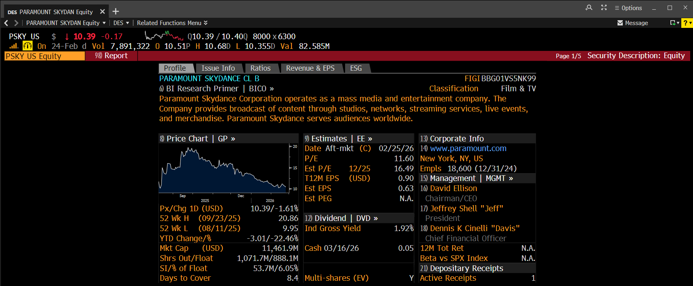

# DES - Security Description

Every security on the Bloomberg Terminal has a security description page that has a consolidated list of information on a security.

Red Toolbar options:

- Input field: Input the name of the security you want to examine (e.g. AAPL US Equity, PSKY US Equity, SGE LN Equity)
- Report: For equities, you also have the option to generate a report, which will create a PDF of the information available on the Security Description page.

## Profile

This contains a general overview of information on the security.

1. Name and Classification: The top section of DES contains the security's name, their FIGI (Financial Instrument Global Identifier) number, and their BICS classification.
2. Extended Description: Courtesy of Hoover's Inc, this section contains a longer form description of the security which can be clicked on and read for more information.
3. Price Information: This section contains price information for the security.

    - Px/Chg 1D: The last traded price of the security, and its one-day gain or loss.
    - 52 Wk H/L: The 52-week high and low of the stock, and the corresponding dates for those prices.
    - YTD Change/%: The YTD change in dollars and percentage
    - Mkt Cap: The market capitalization of the company, priced in billions or millions
    - Shrs Out/Float: The number of shares outstanding, and the number of shares in the float (available for public trading)
    - SI/% of Float: The number of shares currently short in the market, and the percentage of short shares to the float.
    - Days to Cover: A metric that measures how many trading days it would take for all short positions to be covered, based on average daily trading volume.

4. Estimates: This section contains estimates by industry analysts on certain information related to a security, such as their estimated P/E, EPS, PEG.

    - Date: This is the date at which a security is expected to make their earnings call. If there is a "(C)" next to the date, then the date has been confirmed and is no longer an estimate. If there is an "(E)", then the date is still an estimate.
    - P/E: The current Price-to-Earnings ratio of a security.
    - Est P/E: The estimated P/E ratio of a security and the date at which the estimate is for.
    - T12M EPS: The Trailing-12-Months EPS of the security.
    - Est EPS: The estimated Earnings-Per-Share of the company.
    - Est PEG: The estimated Price-to-Growth ratio of the company.
    - EU SSR Liquid: This security is subject to the European Union's Short Selling Regulation, and is classified as a "Liquid Share".

5. Dividends: If a security offers a dividend, information about the dividend payment(s) will be listed here.

    - Ind Gross Yield: The gross dividend yield as indicated by the last issued dividend divided by the current security price.
    - 5Y Net Growth: The 5-year net growth of the dividend
    - Cash: Lists the date and the cash amount of the last issued dividend.

6. Corporate Info: Lists the security's website, their location, and the number of employees.
7. Management: Lists the people in charge of the company, such as the CEO and CFO.
8. Depository Receipts: If the company is available for purchase as a depository receipt.

## Issue Info

## Ratios

## Revenue & EPS

## ESG
